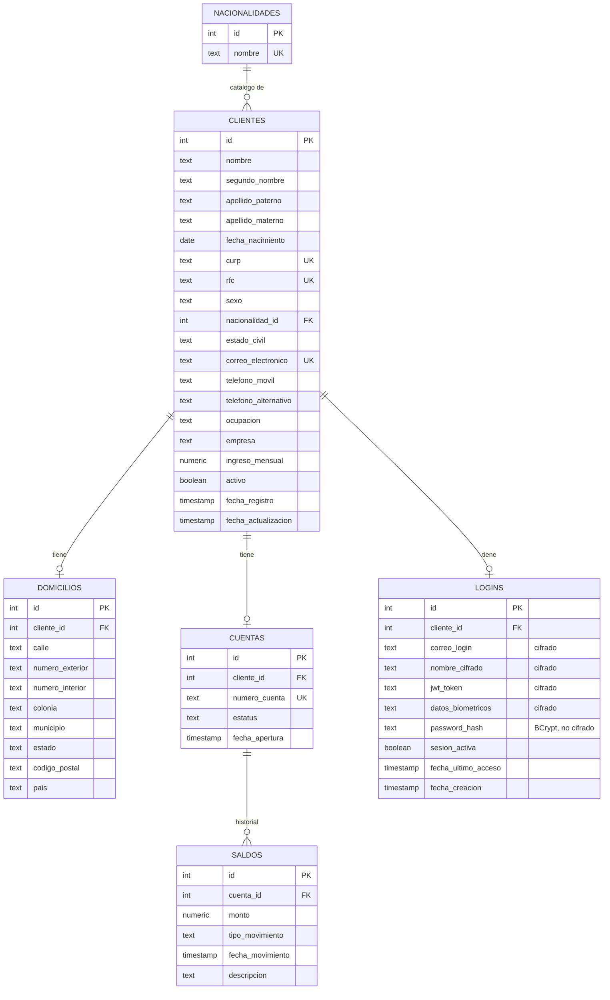

# Onboarding de Clientes Personas Físicas

## Objetivo
Registrar clientes personas físicas, validar su información, crear
automáticamente una cuenta bancaria con saldo inicial, y exponer las
consultas/actualizaciones solicitadas — todo en Postgres, siguiendo la
arquitectura por capas ya usada en el proyecto (`client`/`config`/`entity`/
`exception`/`mapper`/`model`/`repositorys`/`service`/`controller`).

## Diagrama entidad-relación



## Script de creación de base de datos
Migraciones Flyway (`src/main/resources/db/migration/`):
`V4__create_clientes.sql`, `V5__create_domicilios.sql`,
`V6__create_cuentas.sql`, `V7__create_saldos.sql`, `V8__create_logins.sql`,
`V9__add_password_hash_to_logins.sql`,
`V10__create_nacionalidades_catalogo.sql`.

## Decisiones de diseño y por qué

### Tipos de datos
- **`TEXT` en vez de `VARCHAR`**: en PostgreSQL no hay diferencia de
  rendimiento entre ambos (documentado oficialmente); `TEXT` + `CHECK` para
  longitudes es la práctica recomendada.
- **Códigos postales, teléfonos, CURP, RFC, número de cuenta → `TEXT`**,
  no numérico: nunca se usan en operaciones aritméticas y pueden llevar
  ceros a la izquierda.
- **`ingreso_mensual` y `monto` → `NUMERIC`**, no `double`: el dinero no debe
  representarse con punto flotante binario (pierde precisión).
- **Campos categóricos** (`sexo`, `estado_civil`, `estatus`, `tipo_movimiento`)
  → `TEXT` + `CHECK constraint` en vez de `ENUM` de Postgres: más simple y
  no requiere `ALTER TYPE` para agregar valores nuevos después.

### Nacionalidad como catálogo (tabla `nacionalidades`), no texto libre
`nacionalidad` empezó como `TEXT NOT NULL` sin ninguna restricción — cualquier
cadena no vacía pasaba. Se normalizó a una tabla catálogo real:
`nacionalidades(id, nombre)`, poblada con los valores más comunes para un
banco mexicano (mexicana, estadounidense, canadiense, etc., más `OTRA` como
comodín), y `clientes` ahora tiene `nacionalidad_id` como FK en vez del
texto. A diferencia de `sexo`/`estado_civil` (un `CHECK` con 2-5 valores
fijos escritos en la restricción), una tabla catálogo aparte tiene sentido
aquí porque la lista es más larga y conceptualmente son "datos", no una
regla de negocio fija — se podrían agregar nacionalidades sin tocar el
esquema.

`ClienteRequest`/`ClienteActualizaRequest` ahora piden `nacionalidadId`
(no el texto); el servicio valida que exista en el catálogo
(`NacionalidadNoEncontradaException`, 404, si no) y lo resuelve antes de
guardar. `ClienteResponse` devuelve ambos: `nacionalidadId` y `nacionalidad`
(el nombre legible), para no obligar al consumidor de la API a hacer un
segundo lookup solo para mostrar el dato. `GET /nacionalidades` expone el
catálogo completo — es público (como `POST /clientes`), porque hace falta
conocer los ids válidos antes de poder registrar un cliente.

### `saldos` como historial (1:N), no una columna en `cuentas`
Cada movimiento de saldo (apertura, depósito, retiro, ajuste) es una fila
nueva con fecha. El saldo vigente de una cuenta es su registro más reciente
(`findFirstByCuentaIdOrderByFechaMovimientoDesc`), no una columna
desnormalizada — evita inconsistencias entre "el saldo" y "el historial".

### Datos biométricos: `double[]` en Java, `TEXT` cifrado en la base de datos
Los sistemas reales de reconocimiento facial (ej. **MediaPipe
Face Detection/Embedding**, o alternativas como `face_recognition`/FaceNet)
no comparan fotos directamente: generan un vector numérico ("embedding") de
decenas/cientos de posiciones. Por eso el campo se modeló como `double[]`
del lado de Java. Como además debe cifrarse, la columna en Postgres es
`TEXT` (el texto cifrado en Base64) — un valor cifrado deja de ser un
número que Postgres pueda leer como arreglo nativo.
**No se integra ninguna API de reconocimiento facial todavía** (tal como se
indicó explícitamente); el campo queda listo para cuando se implemente.

### Cifrado (tabla `logins`)
AES-256/GCM implementado en Java puro (sin librerías nuevas), vía
`AttributeConverter` de JPA (`AesStringConverter`, `AesDoubleArrayConverter`)
aplicados explícitamente con `@Convert` en cada campo sensible (`correo_login`,
`nombre_cifrado`, `jwt_token`, `datos_biometricos`). La clave se deriva con
PBKDF2 a partir de `security.aes.secret-key` (`application.properties`).

**`sesion_activa` y `fecha_ultimo_acceso` quedan sin cifrar a propósito**:
la tarea programada que cierra sesiones inactivas necesita compararlas
directamente en SQL (`WHERE fecha_ultimo_acceso < ahora - 5 minutos`). Si se
cifraran, habría que traer todas las sesiones activas a memoria y descifrar
una por una para compararlas — mucho menos eficiente.

### JWT
El enunciado pide "una API que proporcione el JWT" — se interpretó como un
endpoint propio (`POST /login`) que **emite** el token (usando la librería
`jjwt`, ya presente en el proyecto), no un servicio externo. De paso se
corrigió un bug preexistente en `build.gradle`: `jjwt-api` estaba declarado
dos veces con versiones distintas (0.12.6 y 0.11.5), y solo existía el
runtime (`jjwt-impl`/`jjwt-jackson`) para la 0.11.5 — si Gradle resolvía la
0.12.6, el JWT habría fallado en tiempo de ejecución por falta de
implementación. Se dejó consistente en 0.11.5.

### El JWT protege la API (no solo se emite)
En una primera versión el JWT se emitía en `POST /login` pero ningún otro
endpoint lo exigía — se podía llamar `GET /clientes` o `DELETE /clientes/{id}`
sin token. Se agregó `spring-boot-starter-security` con:

- **`JwtAuthenticationFilter`** (`security/`): lee el header
  `Authorization: Bearer <token>`, valida la firma/expiración con
  `JwtService`, y además verifica contra la tabla `logins` que
  `sesion_activa = true` **y** que el token coincida con el guardado en
  `jwt_token`. Esto es importante: sin ese segundo chequeo, cerrar sesión
  (`POST /login/{id}/cerrar`) o el auto-logout por inactividad no tendrían
  ningún efecto real sobre la API — el JWT seguiría siendo valido hasta su
  propia expiración aunque la sesión ya estuviera cerrada.
- **`SecurityConfig`** (`config/`): define qué rutas son públicas
  (`POST /clientes` para poder registrarse, `POST /login`, Swagger, y los
  endpoints de las tareas anteriores `/productos`, `/personas*`, que quedan
  fuera de alcance de este enunciado) y cuáles exigen JWT válido
  (`/clientes/**`, `/cuentas/**`, `/login/**` salvo el login mismo).
- Las respuestas 401 usan el mismo formato `{codigo, mensaje}` que el resto
  de la API (`GlobalExceptionHandler`), vía un `AuthenticationEntryPoint`
  personalizado, en vez del 403/HTML por defecto de Spring Security.
- `spring.autoconfigure.exclude` desactiva `UserDetailsServiceAutoConfiguration`:
  sin esto, Spring genera un usuario en memoria con contraseña aleatoria al
  arrancar (para HTTP Basic), que aquí no se usa para nada porque la
  autenticación real es contra `logins`, no contra un `UserDetailsService`.

### Contraseña de login: hash de un solo sentido (BCrypt), no cifrado
`ClienteRequest` ahora exige `password` (mínimo 8 caracteres) al registrar
un cliente. `ClienteServiceImpl.crearCliente()` llama a
`LoginService.registrarCredenciales(cliente, password)`, que guarda en
`logins.password_hash` el resultado de `BCryptPasswordEncoder.encode(...)`
— nunca la contraseña en texto plano.

Este campo **no** pasa por `AesStringConverter` como el resto de la tabla
`logins`. AES es cifrado reversible (se puede descifrar con la clave), y
una contraseña nunca debe poder recuperarse en texto plano — ni siquiera
por quien tiene la clave de cifrado. BCrypt es un hash de un solo sentido:
solo se puede verificar (`passwordEncoder.matches(plano, hash)`), nunca
revertir. Cifrar además el hash con AES no agregaría seguridad real y
complicaría la verificación sin necesidad.

`POST /login` ahora exige `correoElectronico` + `password`. Si el correo no
existe, la contraseña no coincide, o el cliente está dado de baja
(`activo = false`), responde igual (401, `CredencialesInvalidasException`,
mismo mensaje genérico) para no revelar si un correo está registrado ni si
una cuenta en particular está desactivada.

### Inactividad de sesión (5 minutos)
`LoginServiceImpl.cerrarSesionesInactivas()` corre en una tarea programada
(`@Scheduled`, cron configurable en `security.session.check-cron`, cada
minuto por defecto) que busca sesiones activas cuyo último acceso supera
`security.session.inactividad-minutos` (5) y las cierra (`sesion_activa =
false`, borra el JWT).

## Reglas de negocio y validaciones
Todas las validaciones viven en los DTOs `*Request` (Bean Validation), no en
el service — igual que el resto del proyecto:
- Mayoría de edad: anotación personalizada `@EdadMinima(18)` (con
  `@PastOrPresent` para la fecha no futura).
- CURP/RFC: `@Pattern` con la expresión regular oficial.
- Teléfono: `@Pattern` de 10 dígitos exactos.
- Código postal: `@Pattern` de 5 dígitos exactos.
- Ingreso mensual: `@DecimalMin("0.01")`.
- Unicidad de CURP/RFC/correo: se valida en el service (no es posible con
  Bean Validation, requiere consultar la base de datos), lanzando
  excepciones tipadas (`CurpDuplicadaException`, `RfcDuplicadoException`,
  `ClienteYaRegistradoException`) resueltas por `GlobalExceptionHandler` —
  sin `if`, usando `Optional.ifPresent(...)` para disparar la excepción.
- No se permite modificar CURP/RFC/número de cuenta: `ClienteActualizaRequest`
  simplemente no incluye esos campos.

## Excepciones personalizadas
`ClienteNoEncontradoException`, `CuentaNoEncontradaException`,
`CurpDuplicadaException` y `RfcDuplicadoException` (ambas heredan de
`ClienteYaRegistradoException`), manejadas en `GlobalExceptionHandler`
(409 para duplicados, 404 para no encontrados).

## Endpoints
| Método | Endpoint | Descripción | Requiere JWT |
|---|---|---|---|
| POST | `/clientes` | Registra cliente + domicilio + cuenta + saldo inicial | No (hace falta antes de poder loguearse) |
| GET | `/clientes` | Lista todos los clientes | Sí |
| GET | `/clientes/{id}` | Cliente por id | Sí |
| PUT | `/clientes/{id}` | Actualiza datos personales/contacto/domicilio/laborales | Sí |
| DELETE | `/clientes/{id}` | Baja lógica (activo = false) | Sí |
| GET | `/clientes/curp/{curp}` | Cliente por CURP | Sí |
| GET | `/clientes/rfc/{rfc}` | Cliente por RFC | Sí |
| GET | `/clientes/correo/{correo}` | Cliente por correo | Sí |
| GET | `/clientes/cuenta/{numeroCuenta}` | Cliente por número de cuenta | Sí |
| GET | `/clientes/activos` | Solo clientes activos | Sí |
| GET | `/clientes/rango-fechas?desde=...&hasta=...` | Clientes registrados en un rango | Sí |
| GET | `/cuentas/{numeroCuenta}` | Cuenta + saldo actual | Sí |
| GET | `/cuentas/activas` | Cuentas con estatus ACTIVA | Sí |
| GET | `/cuentas/{numeroCuenta}/saldos` | Historial de saldos | Sí |
| POST | `/login` | Verifica correo + contraseña y emite un JWT | No |
| POST | `/login/{clienteId}/cerrar` | Cierra la sesión manualmente | Sí |
| GET | `/nacionalidades` | Catálogo de nacionalidades (id + nombre) | No |

Para probar en Swagger un endpoint que exige JWT: primero `POST /login`,
copiar el valor de `jwt` de la respuesta, y pegarlo en el botón
**Authorize** (candado) con el formato `Bearer <token>`.

## Pruebas unitarias
- `AesEncryptionUtilTest`: cifrado/descifrado de texto y de `double[]`,
  IV aleatorio (dos cifrados del mismo valor no son iguales), valores nulos.
- `EdadMinimaValidatorTest`: casos límite (18 años exactos, un día antes,
  17 años, fecha nula).
- `ClienteServiceImplTest`: alta exitosa (crea domicilio/cuenta/saldo
  inicial y registra credenciales de login), CURP/RFC/correo duplicados,
  cliente no encontrado, baja lógica (no borra físicamente y cierra la
  sesión), cuenta no encontrada.
- `CuentaServiceImplTest`: saldo actual desde el historial, cuenta sin
  movimientos (saldo cero), cuenta no encontrada, historial completo.
- `LoginServiceImplTest`: registro de credenciales (hash BCrypt, sesión
  inactiva), inicio de sesión exitoso, contraseña incorrecta, cliente dado
  de baja, correo no registrado, cierre de sesión, cierre por inactividad.
- `NacionalidadServiceImplTest`: listado completo del catálogo, búsqueda por
  id existente, id inexistente (`NacionalidadNoEncontradaException`).

## Evidencias de pruebas realizadas
Ejecutado contra la API real (Postgres local, `./gradlew bootRun`) el
2026-10-02, con `curl`. Cada petición usa un CURP/RFC/correo generados al
vuelo para no chocar con datos de corridas anteriores.

**1. `GET /clientes/activos` sin token → 401 (ruta protegida, sin credenciales)**
```
{"codigo":401,"mensaje":"Token invalido, ausente o sesion expirada"}
```

**2. `POST /clientes` sin token (pública) → 201, crea cliente + domicilio + cuenta**
```
{"id":3,"nombre":"Ana", ... ,"cuenta":{"id":3,"numeroCuenta":"7877870182","estatus":"ACTIVA", ...,"saldoActual":0}}
```

**3. `GET /clientes/{id}` sin token → 401**
```
{"codigo":401,"mensaje":"Token invalido, ausente o sesion expirada"}
```

**4. `POST /login` con contraseña incorrecta → 401 genérico**
```
{"codigo":401,"mensaje":"Correo o contrasena incorrectos"}
```

**5. `POST /login` correcto → 200, emite JWT**
```
{"jwt":"eyJhbGciOiJIUzI1NiJ9.eyJzdWIiOiIzIiwi...rf9rBo"}
```

**6. `GET /clientes/{id}` con el JWT del paso 5 → 200**
```
{"id":3,"nombre":"Ana", ... }
```

**7. `GET /cuentas/{numeroCuenta}` con el mismo JWT → 200**
```
{"id":3,"numeroCuenta":"7877870182","estatus":"ACTIVA", ...,"saldoActual":0.00}
```

**8. `GET /clientes/{id}` con un token inventado (`Bearer token.invalido.falso`) → 401**
```
{"codigo":401,"mensaje":"Token invalido, ausente o sesion expirada"}
```

**9. `POST /login/{id}/cerrar` con el JWT válido → 204 (cierra la sesión)**

**10. `GET /clientes/{id}` reusando el MISMO JWT ya cerrado → 401**
```
{"codigo":401,"mensaje":"Token invalido, ausente o sesion expirada"}
```
Confirma que `JwtAuthenticationFilter` valida contra `sesion_activa` en la
BD, no solo la firma/expiración del token — un JWT técnicamente válido pero
de una sesión cerrada ya no sirve.

**11. `DELETE /clientes/{id}` (con un login nuevo) → 204, baja lógica**

**12. `POST /login` del cliente recién dado de baja → 401**
```
{"codigo":401,"mensaje":"Correo o contrasena incorrectos"}
```
Confirma el bloqueo de login para clientes con `activo=false`, con el mismo
mensaje genérico que una contraseña incorrecta (no revela el estado de la
cuenta).

**Pruebas unitarias**: 42 pruebas, `./gradlew test` → `BUILD SUCCESSFUL`
(ver sección "Pruebas unitarias" arriba para el detalle por clase).

## Pendiente / fuera de este alcance
- Integrar de verdad una librería de reconocimiento facial (MediaPipe u
  otra) — el campo ya está listo, pero la integración se deja para cuando
  el profesor lo indique explícitamente.
